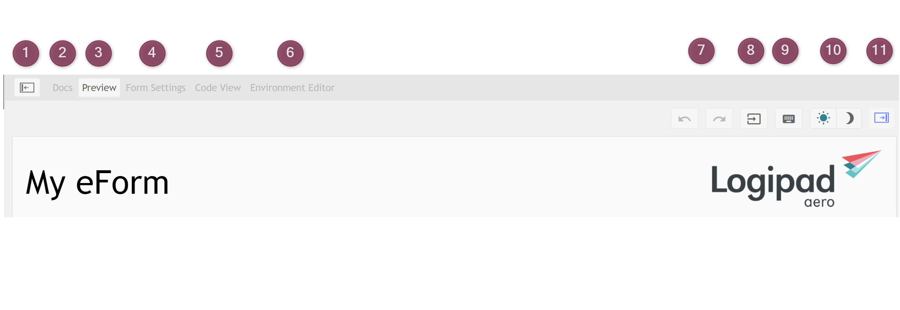
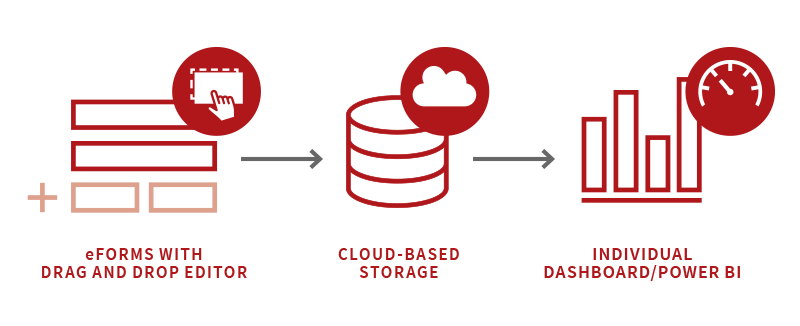
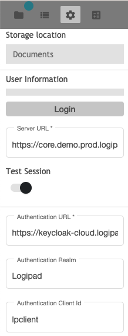
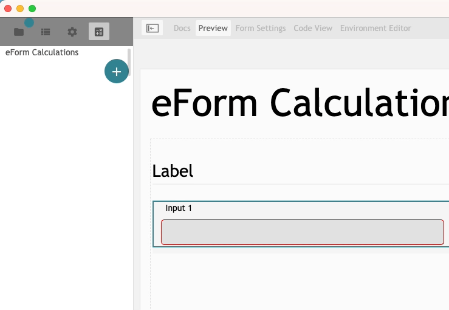
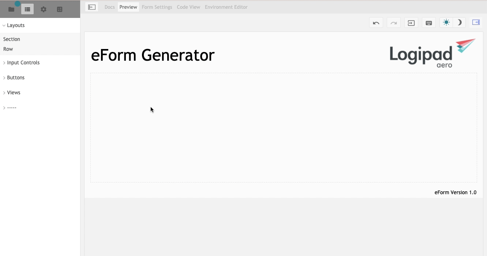

eForm Generator
===============

Welcome to eFormGenerator's documentation!
==========================================
Electronic forms have become more and more important as digitalizaion and automatic data processing has progressed.

eForm are not limited to simple text input or selection fields. For example, Data input can be automated using the integrated QE code scanner. No matter, wherher they record flight-relevant data or performance
evaluations of service personnel. You have the option of evaluating the data via an individual Dashboard or on PowerBI. All entered data is stored on the device for offline use. 
Once a Wi-Fi or mobile data connection isestablished, completed eForm inputs can be sent to the backend System. Even workflows and notifications can be triggered to inform the relevant users/roles when, when eForms have been stored or arrived on the Server.
Documents and Photos can also be attached and forwareded via an appropiate eForm.

Functions
---------
General Functions
-----------------

Menu
----

   General overview

1. Hide/Toogle Menu Sidebar
2. Shows the Information and Documentatoin
3. Preview Window shows the preview of the Form with all selected tools and functions
4. Contains the Settings for e.G. Keyboard Layout or Date/Time configuration
5. Code View: Shows the plain code that is generated while using the eForm Generator
6. Environment Editer: Shows all available Environment Adapters and Values to check or configured
7. Undo/Redo Buttons
8. Fill Environment data from Backend to the actual eForm
9. Activate or deactivate the display Keyboard
10. Switch between Day/Night mode 
11. Hide/Toogle Settings Sidebar

New
---
* To create a new eForm, flick on the function **New**
* In the text field "Form name", please enter the name for the Form.
* Click on "Create" or press "enter" to create the new eForm

Open folder
-----------

If there is already an existing form project on your computer, you can load it via *Open folder*.

Safe
----
Click on **Safe**, if you want to save recent changes.

Safe as
-------
As an alternate to the Save function, you can use *safe as* to select the target directory, in wich the form should be safed.
  
  .. hint::
    The eFormGenerator creates complete directories for saving. To create a new directory named "My eForm" in "/usr/eForm/My eForm", only the directory "/usr/eForm" must be selected, because the eFormGenerator creates the directory "My eForm" automatically.

Export files
------------
The FileExport saves the complete eForm folder structure with all files as a directory. This way the complete eForm can be viewed and opened in the individual files.

Export erp
----------
The finished .erp file is the eform stored in a file that can be uploaded to e.g. the Logipad backend

   Choose file destination

Choose *Export erp* and select a folder for your erp package.
After selecting a folder, the following message apperas:
  
  .. figure::  ../../_images/Logipad-eForms-web.png
   :scale: 65

   erp saved

Now, your erp File is stored at your choosen location.

Upload erp
----------
With the "Upload erp" function, the finished eForm can be uploaded directly to the Logipad backend. The configuration for the selected backend can be found in the settings.
When uploading erp, you will be prompted to enter your login details for the Logipad backend system, which is set in the eFormGenerator Settings.
  
  .. figure::  ../../_images/Logipad-eForms-web.png
   :scale: 65

   Login to the Logipad Backend = MUI

Settings
========

   Overview about the Logipad Settings

Storage location
----------------

User information
----------------

Test Session
------------
The "Test Session" switch can be used to switch between the test and production environment for the upload.

Authentication
--------------

Authentication URL
^^^^^^^^^^^^^^^^^^
The Authentication URL is used for Multi-Factor-Authentication. In this Case we use Keycloak. 
Insert the https:// URL for the Authentication service

Authentication Realm
^^^^^^^^^^^^^^^^^^^^^
The Authentication Realm describes the used Realm in e.G. Keycloak for your System

Authentication Client ID
^^^^^^^^^^^^^^^^^^^^^^^^
The Authentication Client ID describes the ID, wich the eFormGenerator should use for Login

Form Settings
=============

  .. figure::  ../../_images/Logipad-efG_FormSettings.png
   :scale: 75
   :align:: left

   All available Settings for the eForms display.

Used keyboard
-------------
The Keyboard can be chosen by this option, to use either the Logipad Keyboard or the System Native Keyboard on your Device.

Apple Controls
--------------
By default, the iOS operating System uses its own iOS Tools for Picker like Datepicker or Date/Time Picker.
However, if "Display Apple Controls in iOS App" is disabled, the Logipad Tools are used instead.

Used Date and Time format
-------------------------
In this section, you can choose the display Settings for the Date and Time Settings
  
  .. figure::  ../../_images/Logipad-efG-Settings_DateTime.png
   :scale: 75

   Available Settings.

eForm Calculations
==================
The eFormGenerator can perform calculations in fields. These are added and configured in the tab for calculations. 
**NOTE:** The Field "Input Type" has to be *Number*!

  .. figure::  ../../_images/Logipad-efG_Calculations.png
   :scale: 75

   Available Calculations for Fields.

  .. figure::  ../../_images/Logipad-efG_Calculations_sum.png
   :scale: 75

   Shows the available Sum Calculation for two Fields.

Three fields are required for the calculation. Two fields with values and one in which the result is written. The fields are selected via drop-down.

    .. only:: html

   Shows the Settings for a calculated Field.

Layout Section
===============

In this section we will look at the elements of the layout. We will look at the various functions and the WYSIWYG editor in detail.
To use the Layout Form Tools, create at first a new Form using the **New** function. Also you can open an existing eForm by using **Open folder** or **Import ERP**
  

.. list-table:: 
    :name: Layout Bilder
    :class: borderless

    * - .. image::  ../../_images/Logipad-efG_layout_1.png
      - .. image::  ../../_images/Logipad-efG_layout_2.png
      - .. image::  ../../_images/Logipad-efG_layout_3.png

- All available elements are dragged and dropped from the overview into the eForm. Here they can be moved and adjusted afterwards.

Section
-------

With the "Section" element you can build the whole eForm in a structured way. New rows are created within the section, all added elements are then part of this section.
The section can be given a heading, so that the eForm can be visually divided into several sections.

For the layout design of an eForm there are two variants:
* Sections
* Rows

    .. only:: html sphinx

The section can be renamed as desired. If you don't want the section to be named, you can deactivate it using the checkbox.
Further rows for the section are created in the properties of the section.

.. 
  ---------------------------------------------- Ab hier ist alter Kontent, dieser Dient nur als Vorlage!!! --------------------------------- 
  -------------------------------------------------------------------------------------------------------------------------------------------

**VORLAGEN**
======

Etwas *kursiv dargestellter*,
etwas **fettgedruckter** Text,
und etwas Text in ``Maschinenschrift``;

Tief gestellter Text: :sub:`123` und
hoch gestellter Text: :sup:`456`

.. epigraph::

    "Phantasie ist wichtiger als Wissen, denn Wissen ist begrenzt."

    -- Albert Einstein

.. line-block::

    "Jede Blüte will zur Frucht
    Jeder Morgen Abend werden
    Ewiges ist nicht auf Erden
    Als der Wandel, als die Flucht."

    -- Hermann Hesse (Ausschnitt aus dem Gedicht "Welkes Blatt")

.. hint::

    Hier wird ein Hinweis ausgegeben.

.. warning:: 
    Hier mal ein Text mit einer Warnung

.. error:: 
  Dieses ist ein Errortext

.. tip:: 
  Noch ein kleiner Tipp

.. important:: 
  Ganz wichtig, diesen Text nicht vergessen!

.. note:: 
  Man darf aber auch eine kleine Notitz nicht vergessen ;)

Briefing State
==============

Briefing state can have one of four values:

- *Ready* this initial state is a read-only one. No data can be entered. 
- *Active* this state allows the user to enter the data.
- *Finalized* before submitting Briefing packages to the ground, the current active Briefing needs to be finalized. Only the the master user is allowed to send packages to the ground. Depending on a particular configuration, Briefing can only be finalized when all required input fields are filled. A check list of required fields can be found in the subsection Flight Summary of the Flight Plan Section.
- *Archived* Finalized briefings which were successfully synchronized back to the server get status “archived”