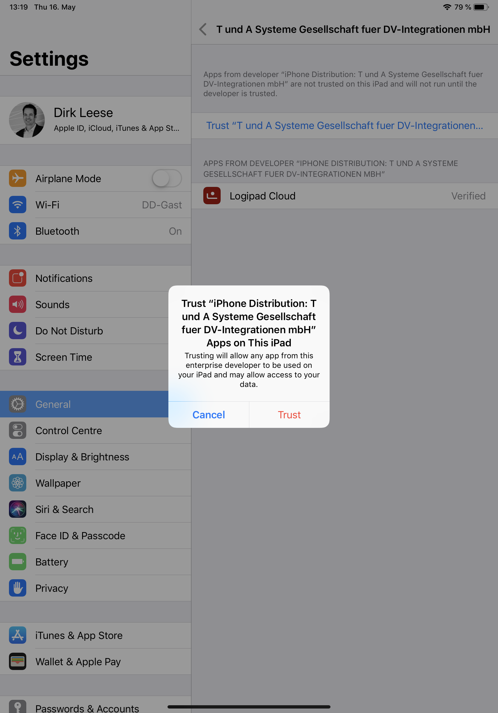

.. _Installation:

Logipad Client Installation
===========================

iOS
---
To install the latest official Demo Version of Logipad to your iPad device, open the Safari browser from your iPad and enter the following URL:

Download Logipad for iOS from Microsofts Appcenter:

https://install.appcenter.ms/orgs/logipad/apps/logipad-demo/distribution_groups/logipad-demo-public

After downloading the application open the Settings application from your iPad and trust the application

1. Open Settings Application
2. *General* => *Device Management*
3. choose *T und A Systeme Gesellschaft fuer DV-Integration*
4. select *Trust* application

Find screenshots below for further Information.

.. figure::  ../../_images/Settings.png
   :scale: 80
    
   Settings Application: select *Device Management*

    
   Select T&A Systeme ..

    
   Select "Trust T&A Systeme ....."

    
   Confirm Trust  

Now, you are able to launch Logipad

    
   Launch Logipad and select "Allow"

Microsoft Window
----------------
